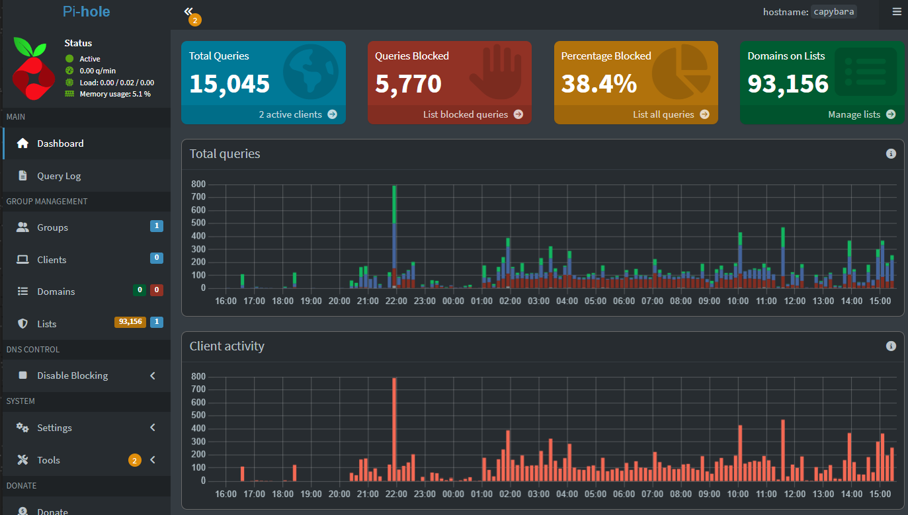

# Headless Linux Home DNS Server (Chromebook Repurpose)

## Project Overview
This project demonstrates how to rescue deprecated consumer hardware—specifically a Samsung Chromebook 4 ("BLUEBIRD") powered by an Intel Celeron N4000 platform—and repurpose it into a dedicated, low-power, fanless headless home server running a minimal Linux OS to provide network-wide privacy, data telemetry blocking, and DNS filtering.

## Architecture and Tech Stack
* Hardware: Samsung Chromebook 4 (Intel Celeron N4000, 4GB RAM, 32GB eMMC)
* Host OS: Debian 12/13 (Minimal Netinst Architecture, text-only, non-GUI)
* Core Application: Pi-hole (Core DNS-sinkhole engine)
* Firmware/Bootloader: Coreboot/UEFI custom firmware deployment via MrChromebox utility
* Protocols: DNS, IPv4 Static Routing, SSH, Systemd ACPI event management

## Step-by-Step Implementation

### 1. Firmware Flash and OS Installation
* Bypassed Google's restrictive native bootloader by flashing custom UEFI ROM firmware using the MrChromebox script.
* Performed GPG cryptographic verification and matched sha512sum hashes against official Debian mirrors to verify ISO mirror integrity before deployment.
* Configured a minimal Debian Netinst environment, unchecking all desktop graphical components (such as GNOME or XFCE) to keep base memory utilization under 250MB RAM at idle.

### 2. Low-Level Linux Tweaks and Power Management
Laptops naturally sleep when closed. To transform the device into an active, 24/7 headless server that operates safely inside a closed cupboard with the screen shut, modified the Linux system daemon controls:

```bash
sudo nano /etc/systemd/logind.conf
```

Altered the configuration to prevent suspend on lid actions:
```text
HandleLidSwitch=ignore
HandleLidSwitchExternalPower=ignore
HandleLidSwitchDocked=ignore
```

Applied changes instantly via:
```bash
sudo systemctl restart systemd-logind
```

### 3. DNS Sinkhole Setup (Pi-hole)
* Provisioned the Pi-hole core package via local curl execution.
* Locked the server's network configuration down to a strict, local static IPv4 address.
* Set upstream lookup routing to Cloudflare DNS (1.1.1.1).
* Configured advanced local parameters securely via administrative CLI flags:
```bash
pihole setpassword
```

### 4. Network Optimization and Interface Transition
* Upgraded the host connection from a wireless link to a full 1,000 Mbit/s Gigabit Ethernet pipeline using a dedicated USB-to-Ethernet interface, achieving near-zero latency.
* Resolved interface permission conflicts by switching NetworkManager parameters to manage the new physical link.
* Configured target network devices manually to route network requests directly through the Chromebook gateway.
* Disabled hidden web browser settings (such as Chrome's Secure DNS/DNS-over-HTTPS) to ensure network parameters were strictly enforced.

## Project Verification and Results
* Monitored telemetry block logs via the web administration interface.
* Verified real-time tracking script suppression via independent ad-block testing arrays, achieving an active network-level ad-blocking efficiency rate of 91%.

## Project Analytics and Metrics
Below is a live look at the production dashboard operating on the repurposed hardware, showing real-time client traffic, system resource optimization (5.1% memory utilization), and active telemetry sinkholing.


